# Sports Tournament & Clothing Store Database System

## Overview

This project is a relational database system designed for managing sports tournaments, national teams, players, referees, coaches, stadiums, matches, and clothing store employees.

The system integrates sports tournament management with clothing store management.

The project was developed using:

- ERD Plus
- PostgreSQL
- pgAdmin
- SQL
- GitHub

---

# System Description

The database manages:

- National teams
- Players
- Coaches
- Referees
- Matches
- Stadiums
- Match events
- Tournaments
- Clothing stores

The system allows:

- Tournament management
- Match tracking
- Employee management
- Match event tracking
- Data analysis using SQL queries

---

# ERD Diagram


---

# DSD Diagram


---

# Main Entities

## NationalTeam
Stores information about national sports teams.

## MatchTeam
Associative entity connecting matches and national teams.

Each match includes exactly:
- One HOME team
- One AWAY team

## Player
Stores player information including team membership and player score.

## Coach
Stores coach information.

## HasCoach
Associative entity connecting coaches and teams.

Allows:
- Multiple coaches per team
- One coach to coach multiple teams

## Referee
Stores referee information.

## Match
Stores match information.

## MatchEvent
Stores events that occur during matches.

## Stadium
Stores stadium information.

## Tournament
Stores tournament information.

## ClothingStore
Stores clothing store information.

---

# Main Relationships

## Team Relationships

- NationalTeam → Player (1:N)

- NationalTeam ↔ Match (N:N)
Implemented using MATCH_TEAM.

Each match must contain exactly:
- HOME team
- AWAY team

- Coach ↔ NationalTeam (N:N)
Implemented using HAS_COACH.

---

## Match Relationships

- Match → MatchEvent (1:N)

- Match → Referee (N:1)

- Stadium → Match (1:N)

---

## Tournament Relationships

- Tournament → Match (1:N)

- ClothingStore → Tournament (1:N)

---

## Employment Relationships

- ClothingStore → Player (1:N)

- ClothingStore → Coach (1:N)

- ClothingStore → Referee (1:N)

---

# Database Schema

## NationalTeam

- team_id
- team_name
- country
- team_rank
- team_colors
- founded_date
- sport_type
- team_details_json

---

## MatchTeam

- match_id
- team_id
- team_role

---

## Player

- player_id
- first_name
- last_name
- birth_date
- nationality
- position
- height
- jersey_number
- score
- team_id
- store_id

---

## Coach

- coach_id
- first_name
- last_name
- birth_date
- nationality
- years_of_experience
- contract_start_date
- store_id

---

## HasCoach

- coach_id
- team_id

---

## Referee

- referee_id
- first_name
- last_name
- birth_date
- nationality
- certification_level
- years_of_experience
- store_id

---

## Match

- match_id
- match_date
- status
- home_score
- away_score
- attendance
- weather_json
- referee_id
- tournament_id

---

## MatchEvent

- event_id
- event_type
- event_minute
- event_description
- severity_level
- match_id

---

## Stadium

- stadium_id
- stadium_name
- city
- country
- capacity
- build_date
- stadium_type

---

## Tournament

- tournament_id
- season
- start_date
- end_date
- location
- store_id

---

## ClothingStore

- store_id
- store_name
- brand_name
- website
- city
- phone

---

# Data Types Used

The project uses:

- INTEGER
- VARCHAR
- DATE

Fields containing JSON-like information were stored as VARCHAR.

---

# Functional Dependencies and Normalization

## PLAYER

```text
player_id →
first_name,
last_name,
birth_date,
nationality,
position,
height,
jersey_number,
score,
team_id,
store_id
```

Table satisfies 3NF.

---

## MATCH

```text
match_id →
match_date,
status,
home_score,
away_score,
attendance,
referee_id,
tournament_id
```

Table satisfies 3NF.

---

## TOURNAMENT

```text
tournament_id →
season,
start_date,
end_date,
location,
store_id
```

Table satisfies 3NF.

---

# Normalization Summary

All tables were normalized to 3NF to:

- Reduce redundancy
- Prevent anomalies
- Maintain consistency
- Improve integrity

---

# Data Population

Data was inserted into the database using three different methods, according to the project requirements.

## Method 1: Manual SQL INSERT Commands

Some records were inserted manually using SQL `INSERT INTO` commands.

This method was used for small and basic tables, such as:

- ClothingStore
- Tournament
- Stadium

---

## Method 2: CSV Import

Some records were inserted by importing CSV files into PostgreSQL.

This method was used for larger tables, such as:

- Player
- Coach
- Referee

---

## Method 3: Python Data Generation Script

Python scripts were used to generate and insert larger amounts of sample data.

This method was used for tables such as:

- Match
- MatchTeam
- MatchEvent
- HasCoach

The generated data was inserted into PostgreSQL and verified using SQL queries.

# Screenshots

## DSD Diagram


---

## ERD Diagram


---

## PostgreSQL Tables


---

## Sample Queries


---

# Data Population

Data was inserted into the database using three different methods according to project requirements.

## Method 1 – Python Data Generation

Python scripts were used to generate large volumes of realistic data.

Tables populated:

- PLAYER
- MATCH
- MATCHEVENT
- MATCH_TEAM
- CLOTHINGSTORE
- NATIONALTEAM
- REFEREE
- TOURNAMENT

Random generation included:
- Random dates
- Random values
- Random NULL values in selected fields

Verification results:

- PLAYER → 600 records
- MATCH → 500 records
- MATCHEVENT → 800 records
- CLOTHINGSTORE → 50 records
- NATIONALTEAM → 60 records
- REFEREE → 120 records

---

## Method 2 – External Website (Mockaroo)

Mockaroo was used to generate CSV data.

Imported table:

- COACH

Import was performed using pgAdmin Import/Export Data.

Verification result:

- COACH → 600 records

---

## Method 3 – CSV Import

CSV files generated externally were imported into PostgreSQL.

Import process:
- CSV generation
- Validation
- Import into PostgreSQL
- Data verification

---

# Screenshots

## Python Data Generation

### Python Execution

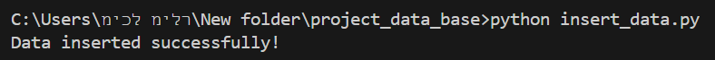

---

### Player Data Example

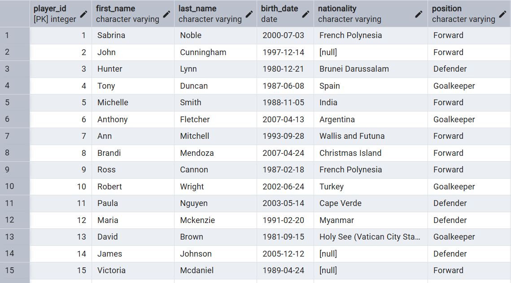

---

### Population Verification

PLAYER

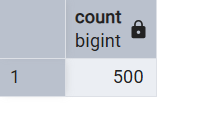

MATCH

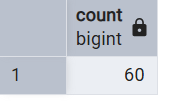

MATCHEVENT

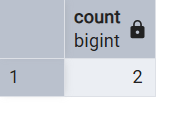

CLOTHINGSTORE

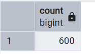

NATIONALTEAM

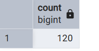

REFEREE

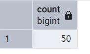

---

## Mockaroo + CSV Import

### Import Configuration

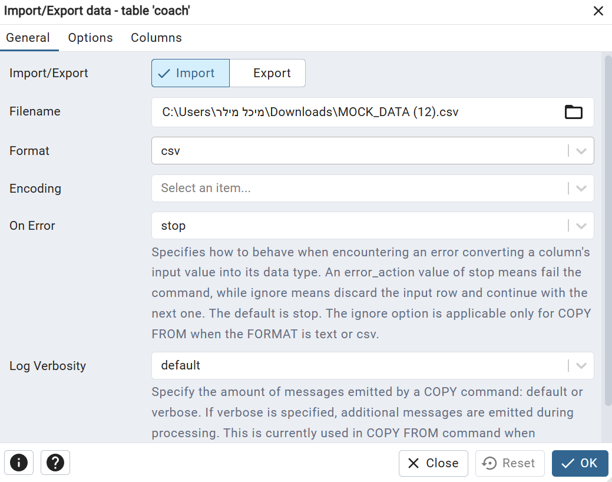

---

### Import Success

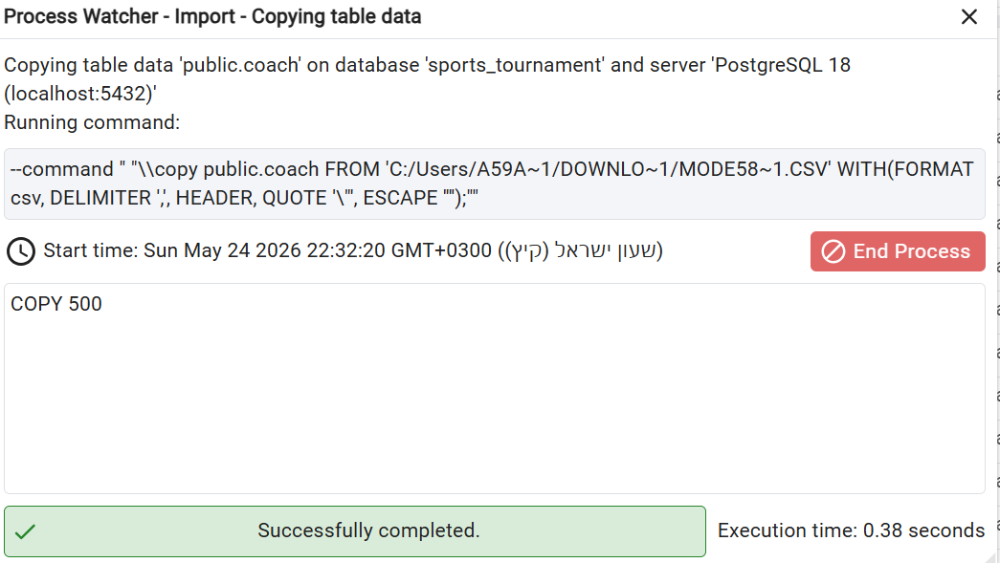

---

### Coach Verification

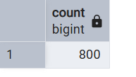

---

### Coach Preview

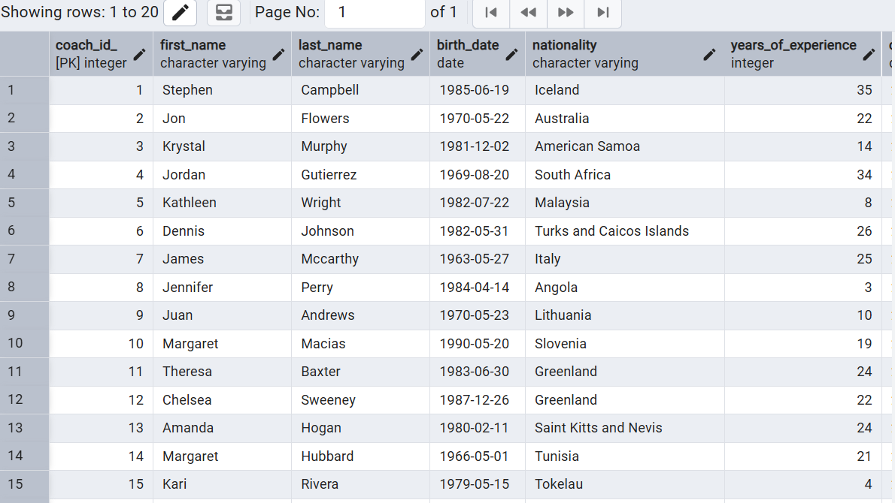

---

## Backup

### Backup Execution

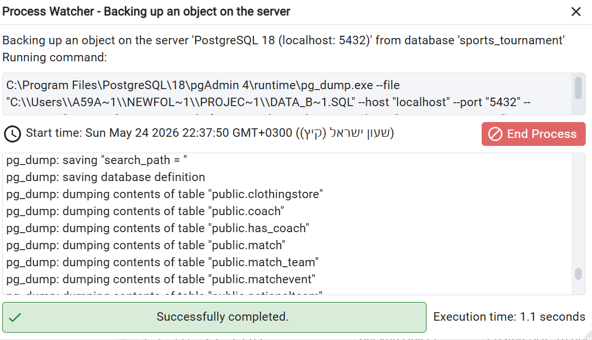

---

# Backup Documentation

A full PostgreSQL backup was created using pgAdmin.

The backup contains:

- Database schema
- Tables
- Relationships
- Constraints
- Complete data population

The backup allows full restoration of the project.

---

# Submitted Files

- README.md
- ERD Diagram
- DSD Diagram
- SQL Schema
- SQL Insert File
- PostgreSQL Backup
- Screenshots
- GitHub Repository

---

# Backup Documentation

A full PostgreSQL backup was created.

The backup includes:

- Database schema
- Tables
- Relationships
- Constraints
- Required amount of records

The backup supports complete restoration.

---

# Technologies Used

- PostgreSQL
- pgAdmin
- SQL
- ERD Plus
- GitHub

---

# Project Goals

- Design a relational database
- Build normalized schemas
- Manage relationships
- Work with PostgreSQL
- Practice SQL
- Create backups

---
# Backup Documentation

A full PostgreSQL backup was created using pgAdmin.

The backup includes:

- Database schema
- Tables
- Relationships
- Constraints
- Data records

The backup supports full restoration.

# Summary

This project demonstrates the design and implementation of a relational database system for sports tournament management integrated with clothing store management.

The project includes:

- ERD
- DSD
- Database implementation
- Data population
- Backup
- Documentation
- Normalization
