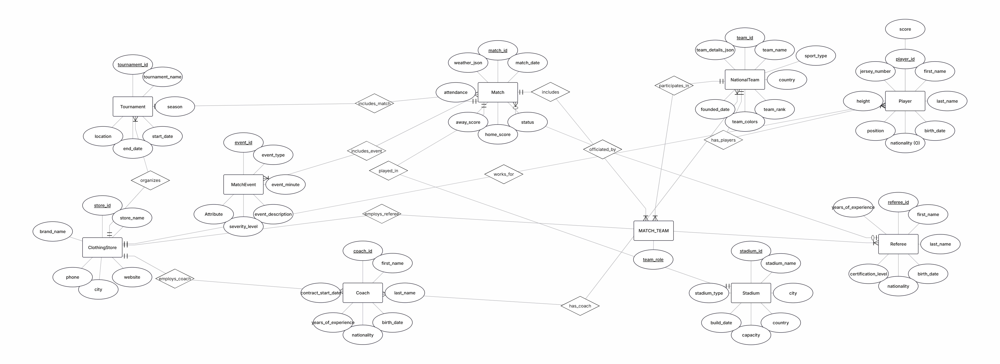
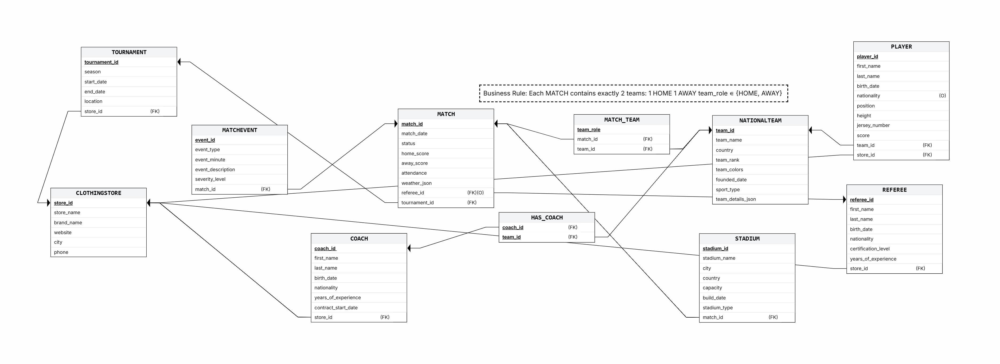
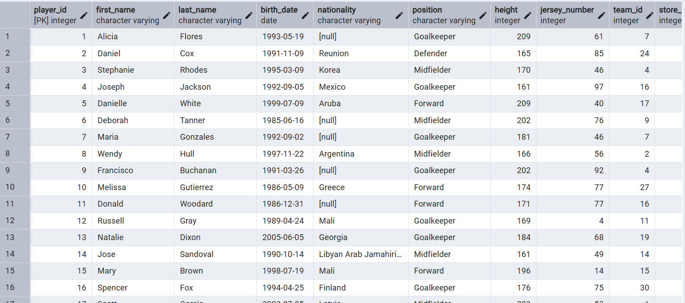
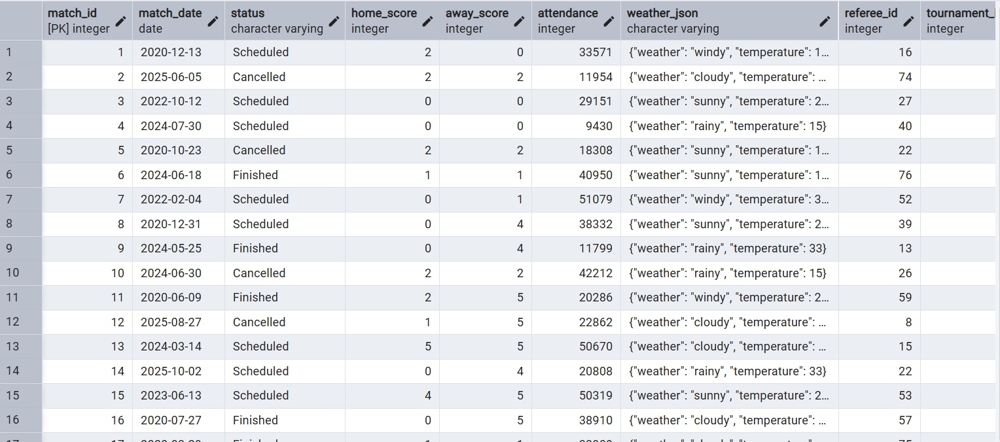
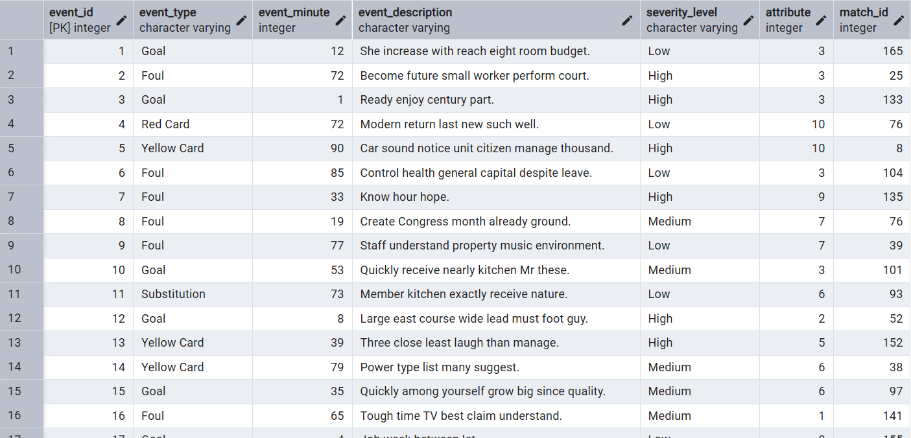
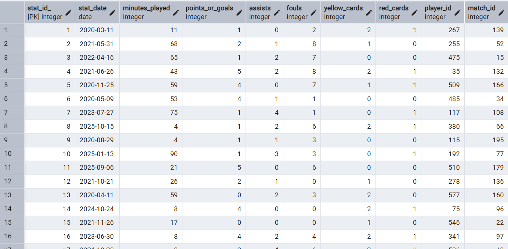

# Sports Tournament & Clothing Store Database System

## Overview

This project is a relational database system designed for managing sports tournaments, teams, players, referees, coaches, stadiums, and clothing store employees.

The system combines sports tournament management with clothing store management, where:
- Players work for clothing stores
- Coaches work for clothing stores
- Referees work for clothing stores
- Clothing stores organize tournaments

The project was developed using:
- ERD Plus
- PostgreSQL
- pgAdmin
- Python
- SQL
- GitHub

---

# System Description

The database manages:

- National teams
- Players
- Coaches
- Referees
- Matches
- Stadiums
- Match events
- Player statistics
- Tournaments
- Clothing stores

The system allows:
- Tournament management
- Match tracking
- Player statistics management
- Employee management
- Match event tracking
- Data analysis using SQL queries

---

# ERD Diagram



---

# DSD Diagram



---

# Main Entities

## NationalTeam
Stores information about national sports teams.

## Player
Stores player information including team membership and clothing store employment.

## Coach
Stores coach information and employment details.

## Referee
Stores referee information and certification details.

## Match
Stores match information including scores and attendance.

## MatchEvent
Stores events that occur during matches.

## PlayerStatistics
Stores player performance statistics.

## Stadium
Stores stadium information.

## Tournament
Stores tournament information.

## ClothingStore
Stores clothing store information and employee relationships.

---

# Main Relationships

## Team Relationships
- A national team has many players (1:N)
- A national team has one coach (1:1)
- National teams participate in matches (N:N)

## Match Relationships
- A match includes many events (1:N)
- A match contains many player statistics (1:N)
- A match is officiated by one referee (N:1)
- A match is played in one stadium (N:1)

## Tournament Relationships
- A tournament includes many matches (1:N)
- A clothing store organizes tournaments (1:N)

## Employment Relationships
- A clothing store employs players (1:N)
- A clothing store employs coaches (1:N)
- A clothing store employs referees (1:N)

---

# Database Schema

## NationalTeam
- team_id
- team_name
- country
- team_rank
- team_colors
- founded_date
- sport_type
- team_details_json

## Player
- player_id
- first_name
- last_name
- birth_date
- nationality
- position
- height
- jersey_number
- team_id
- store_id

## Coach
- coach_id
- first_name
- last_name
- birth_date
- nationality
- years_of_experience
- contract_start_date
- team_id
- store_id

## Referee
- referee_id
- first_name
- last_name
- birth_date
- nationality
- certification_level
- years_of_experience
- store_id

## Match
- match_id
- match_date
- status
- home_score
- away_score
- attendance
- weather_json
- referee_id
- tournament_id

## MatchEvent
- event_id
- event_type
- event_minute
- event_description
- severity_level
- Attribute
- match_id

## PlayerStatistics
- stat_id
- stat_date
- minutes_played
- points_or_goals
- assists
- fouls
- yellow_cards
- red_cards
- player_id
- match_id

## Stadium
- stadium_id
- stadium_name
- city
- country
- capacity
- stadium_type
- match_id

## Tournament
- tournament_id
- tournament_name
- season
- start_date
- end_date
- location
- store_id

## ClothingStore
- store_id
- store_name
- brand_name
- website
- city
- phone

---

# Data Types Used

The project uses:
- INTEGER
- VARCHAR
- DATE

Fields containing JSON-like data were stored using VARCHAR.

Date fields include:
- match_date
- birth_date
- founded_date
- contract_start_date
- start_date
- end_date

---

# Functional Dependencies and Normalization

## PLAYER

```text
player_id → first_name, last_name, birth_date,
nationality, position, height, jersey_number,
team_id, store_id
```

All non-key attributes depend only on the primary key.

Therefore, the table satisfies 3NF.

---

## MATCH

```text
match_id → match_date, status, home_score,
away_score, attendance, referee_id, tournament_id
```

All non-key attributes depend only on the primary key.

Therefore, the table satisfies 3NF.

---

## TOURNAMENT

```text
tournament_id → tournament_name, season,
start_date, end_date, location, store_id
```

There are no transitive dependencies.

Therefore, the table satisfies 3NF.

---

# Normalization Summary

All tables were normalized to 3NF in order to:
- Reduce redundancy
- Prevent update anomalies
- Maintain consistency
- Improve database integrity

---

# Data Population

Data was inserted using multiple methods:

## Python Scripts
Python scripts were used to generate large amounts of random data for:
- Players
- Matches
- Match events
- Player statistics

## External Websites
Mockaroo and GenerateData were used to generate realistic data.

## CSV / Excel Files
CSV files were imported into PostgreSQL tables.

---

# Data Population Screenshots

## Screenshot 1



---

## Screenshot 2



---

## Screenshot 3



---
## Screenshot 4



---

# Backup Documentation

A full PostgreSQL backup was created using pgAdmin.

The backup includes:
- Database schema
- Tables
- Relationships
- Constraints
- Data records

The backup allows complete restoration of the system.

---

# Technologies Used

- PostgreSQL
- pgAdmin
- Python
- ERD Plus
- SQL
- GitHub

---

# Project Goals

The main goals of the project were:
- Designing a relational database
- Building a normalized schema
- Managing relationships between entities
- Working with PostgreSQL
- Practicing SQL
- Creating backups and restoring databases

---

# Summary

This project demonstrates the design and implementation of a relational database system for sports tournament management integrated with clothing store employee management.

The project includes:
- ERD design
- Relational schema design
- Database implementation
- Data population
- Backup creation
- Documentation
- Normalization analysis