# Stage C – Database Integration and Views

## Student Names

* מיכל מילר

---

# Introduction

In this stage, we performed database integration between our original Sports Tournament Management System and a database received from another team, which manages a clothing store network.

The goal of this stage was to analyze the received database, reconstruct its design using reverse engineering, integrate both systems into a single database, and create meaningful views for data analysis.

---

# Reverse Engineering Process

## Objective

The received database included only the physical database schema (tables, primary keys, foreign keys, and data). Therefore, a reverse engineering process was performed in order to reconstruct the original ERD.

## Reverse Engineering Algorithm

The following algorithm was used:

1. Extract all tables from the database.
2. Identify the primary key of each table.
3. Identify foreign key relationships.
4. Convert each table into an entity.
5. Convert foreign keys into relationships.
6. Determine relationship cardinalities.
7. Identify associative tables and represent them as many-to-many relationships when appropriate.
8. Construct the ERD of the received system.

---

# Received Department DSD

The DSD of the received database was generated from the restored backup.

## Main Tables

* Branch
* City
* Customer
* Employee
* Inventory
* Product
* Category
* Season
* Supplier
* Sale
* Sale_Inventory
* PaymentMethod

### DSD Screenshot

.png)

---

# Received Department ERD

Using the reverse engineering process, an ERD was reconstructed.

## Main Relationships

* City → Branch
* City → Customer
* City → Supplier
* Branch → Employee
* Branch → Inventory
* Branch → Sale
* Supplier → Product
* Category → Product
* Season → Product
* Product → Inventory
* Customer → Sale
* Employee → Sale
* PaymentMethod → Sale

### ERD Screenshot

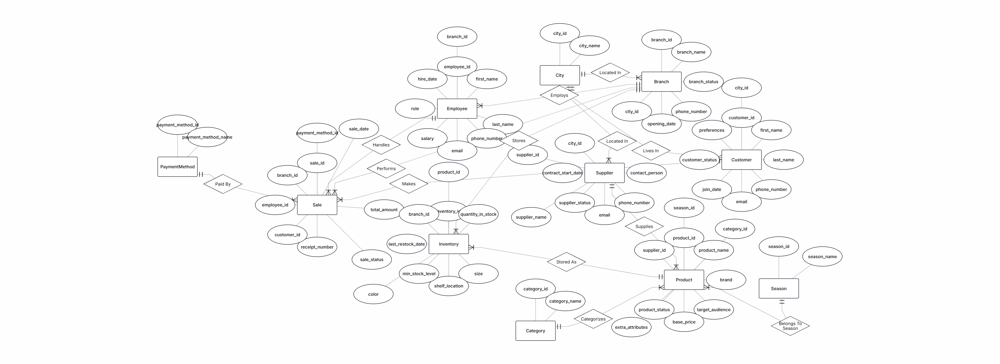

---

# Integrated ERD

After analyzing both systems, an integrated ERD was designed.

## Integration Decision

The original Sports Tournament System contains the entity **ClothingStore**.

The received system contains the entity **Branch**.

We decided to connect both systems using a one-to-many relationship:

**ClothingStore (1) → (N) Branch**

This decision reflects a real-world scenario in which one clothing store organization may operate multiple branches.

### Integrated ERD Screenshot

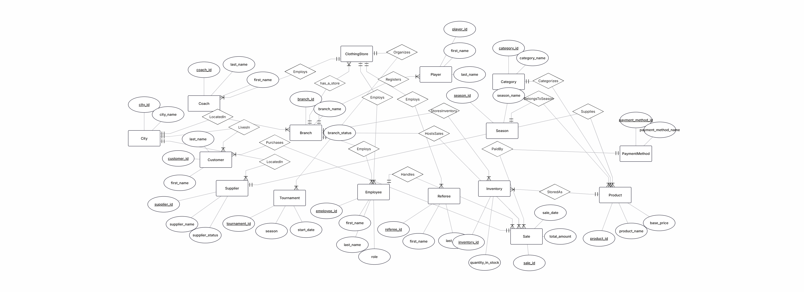

---

# Database Integration

The integration was implemented without recreating existing tables.

Instead, ALTER TABLE statements were used.

## Integration Actions

1. Added a new column `store_id` to the Branch table.
2. Created a foreign key relationship between Branch and ClothingStore.
3. Updated existing branch records.

### Integration SQL

The complete SQL script is included in:

`Integrate.sql`

---

# Integrated DSD

After the integration process, a new DSD was generated.

## Changes

* Branch table now contains `store_id`.
* Foreign key relationship created between Branch and ClothingStore.

### Integrated DSD Screenshot

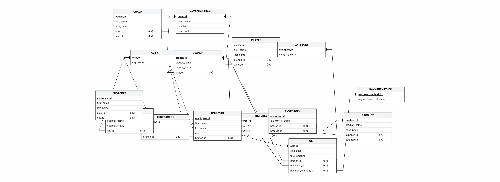

---

# Verification of Previous Queries

All Stage B queries were executed on the integrated database.

The queries continued to operate successfully after the integration.

## Query 1 – Team With the Highest Number of Players

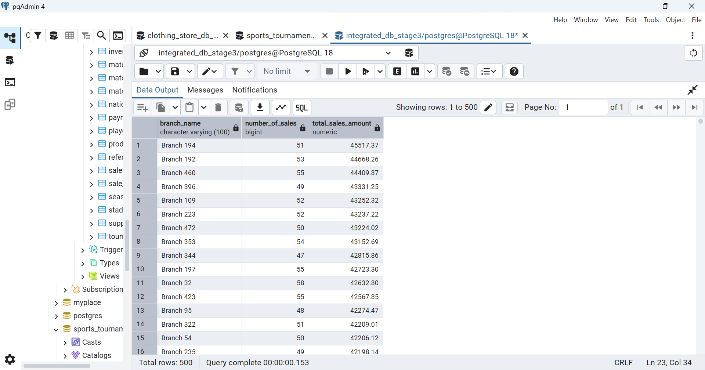

## Query 2 – Average Player Score Per Team

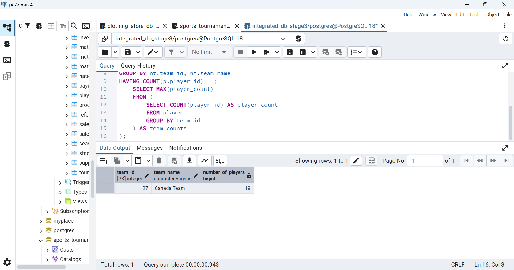

## Query 3 – Match With Highest Attendance

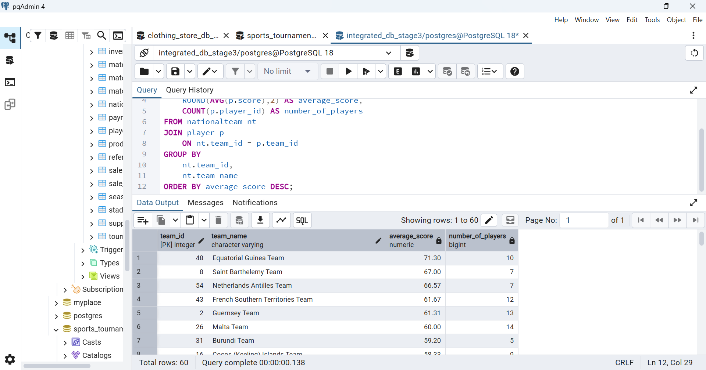

## Query 4 – Referee With the Highest Number of Matches

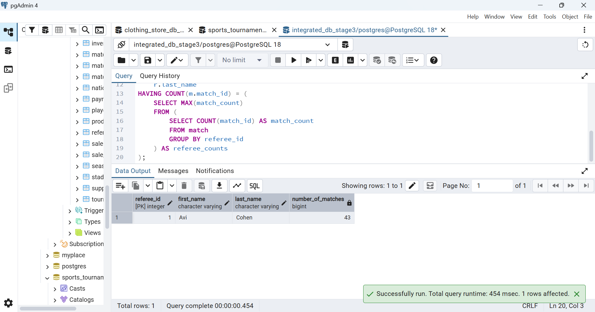

---

# View 1 – Sports Department Perspective

## View Description

This view presents tournaments together with the clothing store responsible for them.

### View SQL

```sql
SELECT *
FROM vw_store_tournaments;
```

### Sample Output

```sql
SELECT *
FROM vw_store_tournaments
LIMIT 10;
```

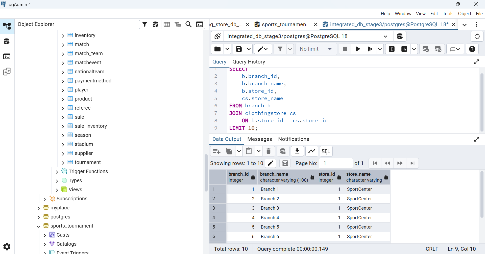

### Query 1

```sql
SELECT *
FROM vw_store_tournaments
LIMIT 10;
```


### Query 2

```sql
SELECT
    store_name,
    COUNT(tournament_id) AS number_of_tournaments
FROM vw_store_tournaments
GROUP BY store_name;
```

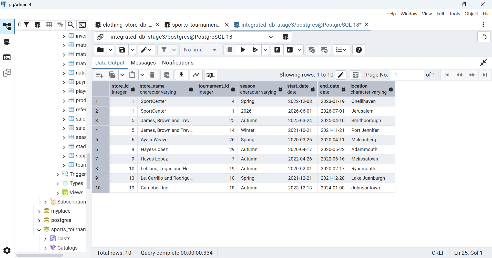

---

# View 2 – Retail Department Perspective

## View Description

This view presents sales together with their branch and clothing store.

### View SQL

```sql
SELECT *
FROM vw_branch_sales;
```

### Sample Output

```sql
SELECT *
FROM vw_branch_sales
LIMIT 10;
```

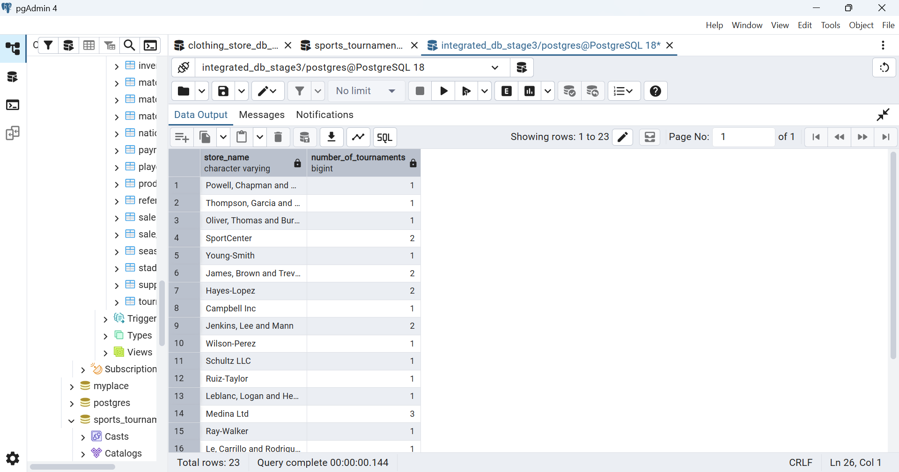

### Query 1

```sql
SELECT *
FROM vw_branch_sales
LIMIT 10;
```


### Query 2

```sql
SELECT
    branch_name,
    COUNT(sale_id) AS number_of_sales,
    SUM(total_amount) AS total_sales_amount
FROM vw_branch_sales
GROUP BY branch_name
ORDER BY total_sales_amount DESC;
```

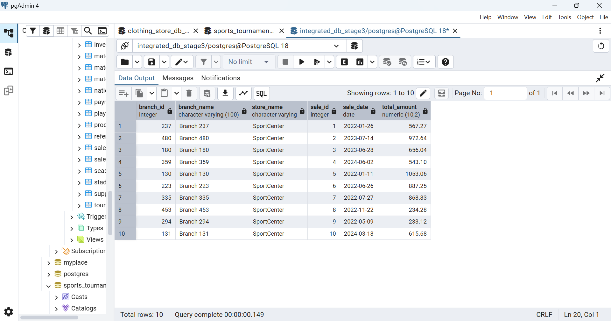

---

# Conclusion

In this stage we successfully:

* Restored and analyzed a received database.
* Reconstructed its ERD using reverse engineering.
* Designed an integrated ERD.
* Integrated both systems using ALTER TABLE operations.
* Created meaningful views from both perspectives.
* Verified that previous queries continued to work correctly.
* Generated a fully integrated database and backup.
